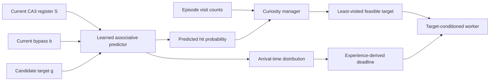

# Current Thought: Predictive CA3-to-DG Association

Status: architectural proposal, not implemented in the current IntrMotiv HRL
code.

## Motivation

The current CA3-like sequence core is a backward-looking shift register. It
records which DG units activated and how long ago they activated, but it does
not predict future DG activity.

Consequently, the current manager cannot answer:

> Given the current state, can the worker deliberately reach target DG unit
> `j`?

The current implementation only attempts a target, observes success or
timeout, and stores the fastest successful elapsed time in `T_ctrl`. The worker
and target-conditioned critic may learn feasibility implicitly, but the
manager does not use such an estimate.

The proposed extension adds a learned association from the current CA3 state
to future DG events. This would turn the shift register into a predictive world
model while retaining DG units as graph landmarks.

## Current Representation

Let:

- `F` be the number of DG units and graph nodes;
- `E = R + L - 1` be the CA3 register length;
- `S_t in R^(F x E)` be the CA3 state;
- `S_t[i,k]` represent the trace of DG unit `i` at temporal position `k`.

The existing deterministic update is:

$$
\bar S_t[i,0]=0,
$$

$$
\bar S_t[i,k]=S_{t-1}[i,k-1],\qquad k=1,\ldots,E-1,
$$

$$
S_t[i,k]=\bar S_t[i,k]+a_t[i]\mathbf{1}[k<R],
$$

where `a_t` is the current DG activity. The unknown part of the transition is
the future DG injection `a_(t+1)`, not the shift itself.

## Simplest Predictive Association

A direct associative model maps the flattened CA3 state to the next DG event:

$$
\ell_{t+1,j}
=b_j+\sum_{i=1}^{F}\sum_{k=0}^{E-1}A_{i,k,j}S_t[i,k],
$$

$$
p_\phi(F_{t+1}=j\mid S_t)
=\operatorname{softmax}_j(\ell_{t+1}).
$$

The association tensor `A[i,k,j]` can learn statements such as:

> When DG `i` occurred at temporal age `k`, DG `j` is likely to occur next.

The predicted DG event can be inserted into the known CA3 dynamics:

$$
\hat S_{t+1}
=\operatorname{Shift}(S_t)
+\operatorname{Inject}(\hat F_{t+1}),
$$

which permits recursive future prediction.

## Why an Unconditional Predictor Is Insufficient

The unconditional model estimates:

$$
p(F_{t+1}\mid S_t).
$$

This describes what usually happens under the behavior policy. It does not
distinguish passive predictability from deliberate controllability. A target
may be unlikely under the current behavior while still being reachable if the
worker chooses different actions.

To represent controllability, prediction must be conditioned on actions or on
the active option:

$$
p_\phi(F_{t+1}\mid S_t,b_t,a_t),
$$

or, at the option/event level:

$$
p_\phi(j,\Delta\mid S_t,g),
$$

where:

- `b_t` is the current bypass observation;
- `a_t` is the low-level action;
- `g` is the requested DG target;
- `j` is the next reached DG event;
- `Delta` is the elapsed time until that event.

## Recommended Event-Level Model

DG events are intentionally sparse. Predicting the next policy-step DG vector
would therefore produce many no-event labels and would emphasize persistence
more than landmark transitions.

The recommended model operates at option starts. For each option, store:

$$
(S_0,b_0,g,j^*,\Delta^*,y),
$$

where:

- `S_0` and `b_0` are the option-start state;
- `g` is the selected target;
- `j*` is the first subsequently reached non-source DG;
- `Delta*` is its elapsed time;
- `y = 1` if `j* = g`, otherwise `y = 0`;
- a timeout is a failed or right-censored observation.

The predictor should estimate a distribution over next DG and arrival time:

$$
p_\phi(j,\Delta\mid S_0,b_0,g).
$$

The target-hit probability within horizon `H` is then:

$$
P_{hit}(S_0,b_0,g;H)
=\sum_{\Delta\le H}p_\phi(j=g,\Delta\mid S_0,b_0,g).
$$

This is an explicit prediction of whether the current state can lead to the
requested target under the target-conditioned worker.

## Training Signal

A basic successful-event loss is:

$$
\mathcal L_{event}
=-\log p_\phi(j^*,\Delta^*\mid S_0,b_0,g).
$$

Arrival time can instead use a separate regression or distributional head:

$$
\mathcal L_{time}
=\operatorname{Huber}(\log\hat\Delta,\log\Delta^*).
$$

Timeouts must be included. Ignoring them would train only from successes and
would make every attempted target look reachable. Depending on the output
parameterization, timeouts can contribute:

- binary failure loss for `P_hit`;
- a no-event/timeout class;
- a censored survival loss stating that no target hit occurred before `H`.

Accidentally reached DG nodes may supervise the next-event model. This is an
auxiliary world-model target, not PPO goal relabeling: the rollout action,
target, advantage, and policy loss remain unchanged.

## Manager Integration

The scientific objective is curiosity, not movement toward cheap targets.
Predicted reachability should therefore constrain target selection rather than
rank targets by cost.

Let `n[j]` be the episode-local visit count. Select:

$$
g^*
=\arg\min_{j:P_{hit}(S,b,j;H)>\epsilon}n[j].
$$

This preserves the current curiosity rule:

- novelty remains the least-visit score;
- predicted reachability masks targets that currently appear infeasible;
- if no target passes the threshold, fall back to the least-visited eligible
  target so exploration does not stop.

The arrival-time distribution can provide an experience-dependent deadline:

$$
H(S,b,g)=Q_{1-\alpha}(\Delta\mid S,b,g)+m,
$$

where `Q` is a high quantile and `m` is a small fixed margin. This generalizes
the current minimum-time deadline, which uses:

$$
H(i,j)=\left\lceil T^{ctrl}_{ij}(1+\rho)\right\rceil+m.
$$

`T_ctrl` should remain as a simple empirical fallback and calibration signal.



## Alternative: Action-Conditioned One-Step Prediction

A more literal world model predicts the next DG injection for each low-level
action:

$$
p_\phi(F_{t+1}\mid S_t,b_t,a_t).
$$

For a candidate goal `g`, combine it with the worker policy:

$$
p(F_{t+1}\mid S_t,b_t,g)
=\sum_a\pi(a\mid S_t,b_t,g)
p_\phi(F_{t+1}\mid S_t,b_t,a).
$$

The predicted DG injection can be recursively rolled through the fixed CA3
shift dynamics. This is more explicitly action-controllable, but it has three
costs:

1. sparse no-event labels dominate one-step training;
2. recursive model errors compound over an option horizon;
3. comparing all candidate goals requires multiple imagined rollouts.

For the first implementation, the event-level option-conditioned predictor is
more direct and easier to validate.

## Relationship to the Current Components

| Component | Current role | Proposed role |
|---|---|---|
| DG | Online landmark representation | Same, also supplies prediction labels |
| CA3 register | Backward temporal memory | Predictive state for future DG events |
| `T_ctrl` | Minimum observed successful time | Empirical fallback and calibration |
| Manager | Least-visited eligible target | Least-visited predicted-feasible target |
| Worker | PPO policy conditioned on target | Same |
| Critic | Implicit expected worker return | Same; not a replacement for explicit prediction |

## Main Technical Risk: DG Identity Drift

The DG projection is learned online. The semantic meaning of "DG unit 7" can
therefore change while the predictive association is learning. This can make
old graph edges and predictor targets inconsistent.

Candidate controls are:

1. stop gradients through DG labels used by the predictor;
2. update the predictor more slowly than the DG projection;
3. maintain a target/EMA copy of the DG encoder for labels;
4. warm up the DG representation and then freeze or greatly slow it;
5. reset or decay predictive associations when DG representations move too
   far.

This issue should be addressed before interpreting predictive accuracy as
landmark controllability.

## Proposed First Version

1. Keep the current target-conditioned PPO worker unchanged.
2. At option start, save detached `S_0`, `b_0`, and target `g` in recurrent
   state or an auxiliary learner buffer.
3. At first non-source DG event, record reached DG and elapsed time.
4. Record target hit or timeout for every option, including failures.
5. Train a small CA3-to-event predictor with hit, next-DG, and time outputs.
6. Initially log predictions without using them for target selection.
7. Validate calibration and DG stability.
8. Then use predicted hit probability only as a feasibility mask.
9. Replace the fallback deadline with a predicted time quantile only after the
   time distribution is calibrated.

The key separation is:

```text
visit count chooses what is interesting;
the predictive CA3 association estimates what is currently feasible;
the worker learns how to reach it;
T_ctrl preserves direct empirical timing evidence.
```
