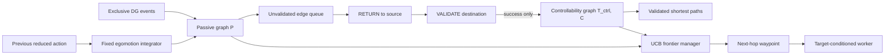
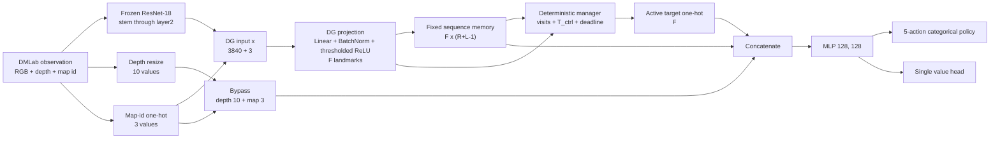
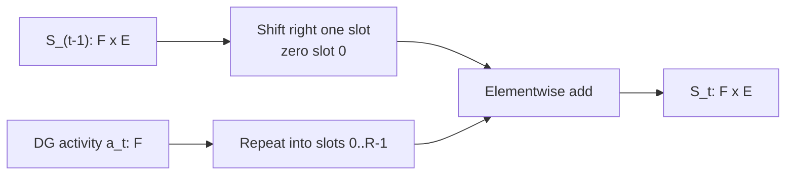
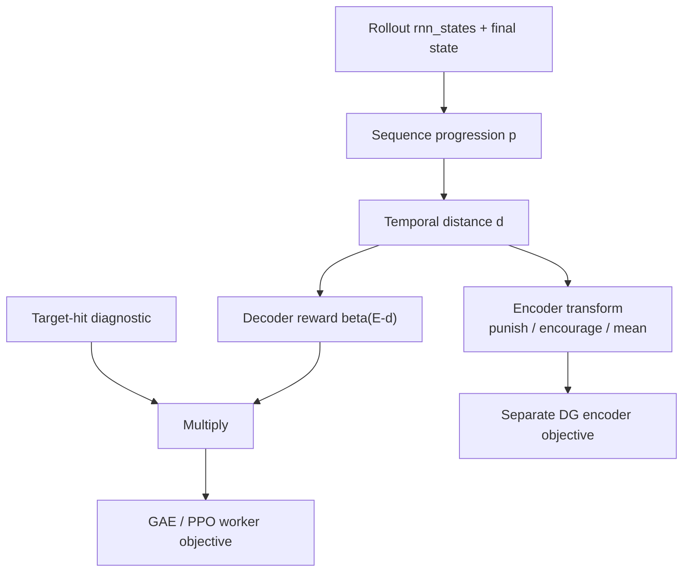

# IntrMotiv Controllable-Graph HRL Architecture

> Implementation repair note (2026-09-01): fresh `layer2_resnet18` actors now
> preserve the loaded ImageNet trunk during Sample Factory policy
> initialization. The unused-unit batch objective uses valid-only,
> pre-threshold softplus recruitment; DG rows are normalized after SGD; global
> option selection uses the configured fast-weight half-life; and an empty CA3
> trace no longer aliases DG 0. Historical checkpoints retain their original
> model state for compatibility.

This document specifies the HRL implementation currently in
`sf_working_directories/IntrMotiv` on NEMO2. It describes what the code does,
including tensor layouts, update ordering, reward alignment, gradient routing,
active batch parameters, and known implementation boundaries. It is not a
description of the earlier Jannek runs.

Snapshot inspected: 2026-08-19. Repository base commit:
`0d6ad8251557a9cd8fd43b4099e1379af017379c`. The IntrMotiv working directory is
currently uncommitted in that working tree, so the source files listed below
are the authoritative version.

## 1. Source Map

| Responsibility | Source |
|---|---|
| Entry point and `rnn_size` derivation | `sf_working_directories/IntrMotiv/dmlab/train_hipposlam.py` |
| Visual, DG, depth, and instruction encoder | `sf_working_directories/IntrMotiv/dmlab/custom_encoder.py` |
| Sequence memory and HRL integration | `sf_working_directories/IntrMotiv/dmlab/custom_core.py` |
| Controllable graph state machine | `sf_working_directories/IntrMotiv/dmlab/hrl_controllable_graph.py` |
| Topological frontier, passive graph, path integration, and SE(2) control | `sf_working_directories/IntrMotiv/dmlab/topological_frontier.py` |
| Policy decoder | `sf_working_directories/IntrMotiv/dmlab/custom_decoder.py` |
| Actor-critic selection | `sf_working_directories/IntrMotiv/dmlab/custom_actor_critic.py` |
| Intrinsic rewards, PPO, encoder loss, metrics | `sf_working_directories/IntrMotiv/dmlab/custom_learner.py` |
| HRL arguments | `sf_working_directories/IntrMotiv/dmlab/custom_params.py` |
| Current 72-run sweep | `sf_working_directories/IntrMotiv/dmlab/experiments/hrl_intrinsic_arch_search.py` |
| HRL unit tests | `sf_working_directories/IntrMotiv/tests/test_hrl_controllable_graph.py` |
| Reward aliases | `sf_working_directories/IntrMotiv/dmlab/reward_summaries.py` |

## Topological Frontier Extension (2026-08-31)

The topological extension is default-off. It is active only when
`hrl_manager_mode` is `topology_visit_direct`, `frontier_direct`, or `frontier_waypoint`, and currently
requires `hrl_controllable_graph=True` with
`hrl_graph_memory=policy_buffer`. `topology_visit_direct` retains the complete
topological state machine but uses novelty-only visit rank, providing the
causal control for UCB frontier selection. The existing `visit_direct` manager and flat
models retain their old state and policy dimensions.

### Memory scopes and replay timing

The learner-owned `PolicyControllableGraph` contains policy-global,
non-gradient buffers for visits, deliberate controllability, passive
transitions, frontier statistics, and optional landmark poses. These buffers
are checkpointed and synchronized through the existing policy state dict. They
are updated once per newly accepted rollout, outside PPO epochs and
minibatches.

Each actor stream stores only trajectory-local state in its RNN state:

- active target and source, age, deadline, and completion diagnostics;
- manager mode, final frontier, next waypoint, and pending validation pair;
- last stable landmark and local transition trace;
- episode pose and one anchor `(x,y,valid)` per DG;
- the relative SE(2) worker condition sampled for the current option.

`rnn_state_t.target` is the worker condition used for action `a_t`. Manager
selection during that forward writes the next target to `rnn_state_{t+1}`.
Learner replay replaces the target slice of the core output with the target
decoded from stored `rnn_state_t`. The stored geometric condition is likewise
read from `rnn_state_t`; motion features are reconstructed from stored local
path state. Consequently a newer learner graph can change future actor
choices, but cannot change PPO inputs for already sampled actions.



### Passive transitions and deliberate validation

A passive directed edge `i -> j` is emitted only for distinct, exclusive DG
activations in one physical episode with elapsed time at most `L=64`. With
action integration enabled, integrated path length must also be at most 64 and
net command displacement must exceed `hrl_passive_min_displacement`. In the
elapsed-time ablation, the motion gate is disabled and elapsed time is retained
as the path-length proxy. Confidence and traversal summaries are confidence-
weighted running means. Confidence two makes an edge a validation candidate,
not a planning edge.

The manager routes through deliberate edges only. A passive candidate causes
`RETURN(j -> i)` followed by `VALIDATE(i -> j)`. Only a target-conditioned
worker hit updates controllability. The fast-weight update remains:

$$
\gamma=0.5^{1/h},\qquad
C_{ij}\leftarrow\gamma C_{ij}+1,
$$

$$
T^{ctrl}_{ij}\leftarrow
\frac{\gamma C^{old}_{ij}T^{ctrl}_{ij}+\tau}{C_{ij}}.
$$

Recruiting DG `j` clears all passive and controllability edges incident to
`j`, its frontier statistics and pose constraints, and increments a graph
generation counter that invalidates active options based on the old landmark.

### Frontier score, routing, and exploration

For every controllably reachable visited node:

$$
S_i=N_i+\beta_U U_i+0.5Y_i,
$$

$$
U_i=\min\left(1,\sqrt{\frac{\log(2+\sum_k E_k)}{1+E_i}}\right),
\qquad Y_i=\frac{D_i+1}{E_i+2}.
$$

`N_i` is inverse visit rank, while `E_i,D_i` count exploration attempts and
discoveries. Travel time gates reachability and builds shortest routes; it is
never part of the curiosity score. Priority is pending validation, a reachable
passive candidate, the best reachable frontier, then exploration at the
current stable landmark. `frontier_waypoint` conditions the worker on the
first hop and replans after every hit. Exploration uses the reserved all-zero
target for at most 64 decisions and ends early on a stable new transition.

### Action path integration and DG localization

When `hrl_action_path_integration=True`, observations contain the previous
reduced action. Reset emits sentinel `5`; subsequent observations emit the
action that produced them. The encoder maps an action repeated by DMLab into
its net midpoint-frame `(forward, strafe, yaw)` transform plus its full
traveled path length. The recurrent manager integrates that transform at
midpoint heading. It tracks displacement, path length, accumulated turn, and
straightness. `hrl_motion_policy_input=True` appends normalized
`(dx,dy,path,sin(theta),cos(theta),straightness)` to the worker condition.

Each DG's first exclusive episode activation fixes a local anchor. The optional
scatter loss applies only to a reactivation of that same unit that is at least
`d_min` command units from its anchor on a trace with straightness at least
0.8:

$$
L_{scatter}=\lambda\operatorname{mean}_{t,j}
m_{tj}\;0.5\operatorname{softplus}\left(\frac{z_{tj}-\theta}{0.5}\right).
$$

The detached mask makes the loss a localization constraint, while gradients
act on pre-threshold DG logits. Distinct nearby units and low-straightness loop
returns are not penalized.

At each physical episode boundary, the environment compares the entire
command-integrated trajectory with DMLab debug positions after optimal
translation, rotation, and scale alignment. The normalized trajectory-shape
RMSE is telemetry only; debug positions never enter observations or policy
state.

### SE(2) matched control

`hrl_landmark_geometry=se2` stores one pose `(x,y,theta)` per valid landmark.
After each accepted rollout, five gradient steps at learning rate 0.05 minimize
passive relative-transform stress, with one gauge-fixed node. The manager may
propose at most three nearest unvalidated neighbors within distance 32, but
these proposals still enter the same deliberate RETURN/VALIDATE protocol.
The relative pose supplied to the worker is `(dx/32,dy/32,sin(dtheta),cos(dtheta))`
and is stored in stream state for exact replay.

## 2. Architectural Summary

The implementation has one learned low-level policy and one deterministic
high-level controller:

- Each of the `F` DG output units is treated as one landmark and therefore one
  possible option/subgoal.
- There is no learned manager network, manager optimizer, manager value head,
  or separate manager reward.
- The manager deterministically selects the least-visited eligible DG node.
- The worker is the APPO/PPO actor conditioned on a target one-hot vector.
- An episode-local matrix `T_ctrl[i,j]` stores the shortest observed option
  elapsed time from source DG `i` to reached DG `j`.
- `T_ctrl` sets experience-derived deadlines. It does **not** rank targets.
- The complete graph/controller state is carried in `rnn_states`, so PPO replay
  can reconstruct the target sequence from observations and initial state.
- PPO goals are never relabeled. Accidentally reached DG nodes can update
  `T_ctrl`, but no hindsight policy or behavior-cloning loss exists in V1.



## 3. Symbols

| Symbol | Meaning | Current batch value |
|---|---|---:|
| `F` | DG units, graph nodes, and possible options | 16 |
| `R` | Number of adjacent sequence slots receiving each DG event | 8 |
| `L` | Nominal sequence length and unknown-edge option horizon | 32, 64, or 128 |
| `E` | Expanded sequence-register length, `E = R + L - 1` | 39, 71, or 135 |
| `P` | Nonrecurrent bypass width | 13 |
| `theta` | DG BatchNorm/ReLU intercept | 2.0 or 2.43 |
| `beta` | Intrinsic reward scale | 0.1 |
| `rho` | Relative option-deadline margin | 0.20 |
| `m` | Fixed option-deadline margin in policy steps | 2 |
| `N` | Minibatch sample count | context-dependent |

There is no independent "option number" parameter. The option set is exactly
the `F` DG nodes.

## 4. Environment and Observation

### 4.1 Current production batch

The running batch uses:

```text
openfield_map2_fixed_loc3_noreward
resolution = 96 x 72
frameskip = 8
depth_sensor = true
environment reward = 0 for the goal
```

The Lua level fixes `rand_num=3`, so the map-id instruction is 3. Goal pickup
increments `_count`, and `hasEpisodeFinished` returns `_count > 0`. Therefore
the running batch has behavior-dependent episode lengths: goal contact ends an
episode before the 120-second timeout.

The additive replacement
`openfield_map2_fixed_loc3_fixedlength_noreward` overrides only
`hasEpisodeFinished` and returns `false`. Its existing timeout then ends every
episode after 120 seconds, or 7,200 engine frames = 900 policy actions at
frameskip 8. It is available for future runs; changing it does not alter the
already-running batch.

### 4.2 Observation split

With depth enabled, the encoder uses:

- RGB channels `obs[:, :3]` for the visual trunk.
- The final depth channel for a 10-value bypass feature.
- The DMLab instruction as a map number, converted to a 3-way one-hot vector
  and multiplied by `number_instruction_coef = 9`.

For the current level the instruction vector is therefore normally
`[0, 0, 9]`.

## 5. Visual and DG Encoder

### 5.1 Layer-2 ResNet path

The active configuration is:

```text
encoder_conv_architecture = layer2_resnet18
normalize_input = false
obs_scale = 255
```

`layer2_resnet18` is distinct from the repository's legacy
`pretrained_resnet` checkpoint-loading branch. However, the active
`ResNet18Layer2` constructor itself defaults to torchvision ImageNet-1K
ResNet-18 weights and freezes all ResNet parameters. It uses:

```text
conv1 -> bn1 -> relu -> maxpool -> layer1 -> layer2 -> AvgPool2d(3,2,1)
```

The RGB tensor is ImageNet-normalized:

$$
\tilde{o}_{t,c} = \frac{o_{t,c} - \mu_c}{\sigma_c},
$$

with `mu = (0.485, 0.456, 0.406)` and
`sigma = (0.229, 0.224, 0.225)` after the configured observation scaling.

For a `72 x 96` image, layer2 produces `128 x 9 x 12`; the extra average pool
produces `128 x 5 x 6`. Flattening gives:

$$
v_t \in \mathbb{R}^{3840}.
$$

The three-dimensional map code `i_t` is appended before the DG projection:

$$
x_t = [v_t; i_t] \in \mathbb{R}^{3843}.
$$

### 5.2 DG projection

The active module is `DGProjection_batchnorm_relu`:

$$
z_t = W_{DG}x_t, \qquad W_{DG}\in\mathbb{R}^{F\times3843},
$$

$$
a_t = \operatorname{ReLU}(\operatorname{BN}(z_t)-\theta)
      \in \mathbb{R}_{\ge 0}^{F}.
$$

Implementation details:

- `W_DG` has no bias.
- BatchNorm has `affine=False`, momentum `0.1`, and no learned scale or bias.
- A DG is active exactly when `a_t[f] > 0`.
- The graph uses the dominant active DG `argmax_f a_t[f]` when more than one
  unit is active; the multi-activation event is only logged.
- After each encoder backward pass, each row of `W_DG` is normalized to unit
  Euclidean norm before the optimizer step.
- The frozen ResNet does not receive gradients. The trainable representation
  component is therefore primarily the direction of each DG projection row,
  plus BatchNorm running statistics.

### 5.3 Bypass

Depth is resized with `nn.Upsample(size=(1,10))` and flattened:

$$
d_t\in\mathbb{R}^{10}, \qquad b_t=[d_t;i_t]\in\mathbb{R}^{13}.
$$

The full encoder output is:

$$
h_t^{enc}=[a_t;b_t]\in\mathbb{R}^{F+13}.
$$

Only `a_t` enters the sequence register and graph logic. `b_t` bypasses the
sequence dynamics and is replaced by the current observation's bypass at every
step.

## 6. Fixed Sequence Memory

The active core is `SimpleSequenceWithBypassCore` (`core_name=BypassSS`). It is
not a GRU despite `rnn_type=gru` in the launch string. `core_name` selects this
custom fixed update instead.

For each DG node `f`, the core maintains a register
`S_t[f,k]`, `k=0,...,E-1`, where:

$$
E=R+L-1.
$$

One update is:

$$
\bar{S}_t[f,0]=0,
$$

$$
\bar{S}_t[f,k]=S_{t-1}[f,k-1],\quad k=1,\ldots,E-1,
$$

$$
S_t[f,k]=\bar{S}_t[f,k]+a_t[f]\,\mathbf{1}[k<R].
$$

Repeated activations add; they do not overwrite previous trace values.



The sequence memory has no trainable parameters. Its flattened output has
`F*E` values.

## 7. Episode-Local HRL State

### 7.1 Packed layout

The HRL extension is appended to the recurrent state. It contains
`F^2 + F + 13` float values:

| Slice/index | Width | Meaning |
|---|---:|---|
| `0` | 1 | Active target id, stored one-based; 0 means none |
| `1` | 1 | Option-start source id, stored one-based; 0 means none |
| `2` | 1 | Option age |
| `3` | 1 | Remaining countdown |
| `4 : 4+F` | `F` | Episode-local dominant-node visit counts |
| `4+F : 4+F+F^2` | `F^2` | Row-major `T_ctrl` matrix |
| next | 1 | Dominant currently active DG id, one-based |
| next | 1 | Target-hit indicator |
| next | 1 | `T_ctrl`-updated indicator |
| next | 1 | Option-reset indicator |
| next | 1 | Multi-activation indicator |
| next | 1 | Option-expired indicator |
| next | 1 | Selected deadline came from learned edge |
| next | 1 | Newly selected deadline |
| next | 1 | Elapsed time on completed hit/timeout |

The final nine fields are one-step diagnostics. They are cleared at the start
of every HRL update and then populated for the current observation.

The complete recurrent state is:

$$
r_t=[\operatorname{vec}(S_t); b_t; q_t],
$$

where `q_t` is the packed HRL state. Its width is:

$$
D_{rnn}=F(R+L-1)+13+(F^2+F+13).
$$

The graph is episode-local because it lives only in `rnn_states`, which Sample
Factory resets at episode boundaries. There is no persistent cross-episode
graph in V1.

### 7.2 Current DG and visits

Define:

$$
A_t=\{f\mid a_t[f]>0\}.
$$

If `A_t` is nonempty, the observed node is:

$$
j_t=\arg\max_f a_t[f].
$$

The implementation increments exactly one visit count:

$$
n_t[j_t]=n_{t-1}[j_t]+1.
$$

Thus visits count policy observations with dominant activation, not unique
spatial visits and not option completions. If `|A_t|>1`, only `j_t` increments;
the event also sets `multi_activation=1`.

### 7.3 Source selection

When an option is reset, its source is the currently dominant DG if one is
active. Otherwise the source is the sequence with the strongest recent trace:

$$
s_t=\arg\max_f\sum_{k=0}^{E-1}|S_{t-1}[f,k]|.
$$

On an all-zero sequence state, `argmax` deterministically returns node 0.

### 7.4 Controllable reachability matrix

`T_ctrl[i,j] = 0` means the edge is unknown. A positive entry is the shortest
observed elapsed option time from source `i` to reached node `j`.

For the old option source `s`, current option age `u`, and observed dominant DG
`j_t`, define:

$$
\tau=u+1.
$$

An edge observation is qualified when a DG is active, `s` is valid, and
`j_t != s`. It does **not** require `j_t` to equal the intended target. The
update is:

$$
T^{ctrl}_{s,j_t}\leftarrow
\begin{cases}
\tau,&T^{ctrl}_{s,j_t}=0,\\
\min(T^{ctrl}_{s,j_t},\tau),&T^{ctrl}_{s,j_t}>0.
\end{cases}
$$

This is qualified hindsight for graph learning only. It does not relabel PPO
actions, advantages, policy targets, or rollout goals.

### 7.5 Target selection

At option reset, each eligible target receives the score:

$$
\operatorname{score}(j)=n_t[j].
$$

The selected target is:

$$
g_t=\arg\min_{j\notin\mathcal{X}}n_t[j],
$$

where `X` always contains the source and, after timeout, also contains the
just-failed target. PyTorch `argmin` breaks ties by the smallest node index, so
selection is deterministic.

There is no novelty coefficient. Novelty is the raw visit count. There is also
no path-cost or cheapness term: `T_ctrl` does not affect target ranking.

### 7.6 Experience-derived deadline

For a source-target pair `(s,g)` with known cost `c=T_ctrl[s,g]>0`, the new
deadline is:

$$
H(s,g)=\max\left(1,
\left\lceil c(1+\rho)\right\rceil+m\right).
$$

For an unknown edge:

$$
H(s,g)=L.
$$

The current batch uses `rho=0.20` and `m=2`. For example, a learned best time
of 10 actions produces `ceil(12)+2=14` actions. `L` is only the fallback for an
unknown edge; after successful experience, the horizon is edge-specific.

### 7.7 Hit, expiration, and update order

For the old target `g`, hit and expiration are evaluated as:

$$
\operatorname{hit}_t = [A_t\ne\emptyset]\,[g\ge0]\,[j_t=g],
$$

$$
\operatorname{expired}_t = [\neg\operatorname{hit}_t]\,[g\ge0]\,[countdown\le1].
$$

Hit takes precedence over timeout. An option resets on hit, timeout, or absence
of a target. The exact per-observation order is:

1. Clear one-step diagnostics.
2. Determine dominant DG and multi-activation status.
3. Increment the dominant node's visit count.
4. Evaluate hit for the old target.
5. Apply a faster-only `T_ctrl` update for any reached non-source DG.
6. Evaluate timeout.
7. If resetting, choose source, target, and deadline; set age to 0.
8. Otherwise increment age and decrement countdown.
9. Return the **new/current** target one-hot.

Consequently, when an old target is hit, `target_hit=1` describes the completed
old option, while the policy action at that same observation is conditioned on
the newly selected target.

```mermaid
stateDiagram-v2
    [*] --> Select: no target
    Select --> Active: choose least-visited eligible DG<br/>set source and deadline
    Active --> Active: no hit and countdown > 1<br/>age += 1, countdown -= 1
    Active --> Select: target DG observed
    Active --> Select: countdown <= 1<br/>exclude failed target once
    Active --> Active: accidental DG observed<br/>option stays active; T_ctrl may update
```



## 8. Target-Conditioned Worker

The core sends the decoder:

$$
y_t=[\operatorname{vec}(S_t);b_t;\operatorname{onehot}(g_t)].
$$

Its width is:

$$
D_{policy}=F(R+L-1)+13+F.
$$

The target representation is a raw one-hot vector, not a learned embedding.
The decoder is a ReLU MLP with widths `[128,128]`. Standard Sample Factory
shared-weight heads then produce:

- one scalar value estimate, because `double_value=False`;
- logits for a 5-action categorical distribution.

The reduced action set is:

1. forward;
2. strafe left;
3. strafe right;
4. look left 20 degrees plus forward;
5. look right 20 degrees plus forward.

## 9. Tensor Dimensions for the Current Sweep

For `F=16`, `R=8`, and `P=13`, the HRL state width is always:

$$
F^2+F+13=256+16+13=285.
$$

| `L` | `E=R+L-1` | sequence `F*E` | base state `F*E+13` | full `rnn_state` | decoder input `F*E+13+F` |
|---:|---:|---:|---:|---:|---:|
| 32 | 39 | 624 | 637 | 922 | 653 |
| 64 | 71 | 1,136 | 1,149 | 1,434 | 1,165 |
| 128 | 135 | 2,160 | 2,173 | 2,458 | 2,189 |

`train_hipposlam.py` derives these full recurrent widths when the CLI specifies
`rnn_size=0`.

## 10. Temporal Distance Signal

The learner reconstructs the sequence memory from stored recurrent states. For
each sample and DG `f`, progression is the first nonzero sequence slot:

$$
p_t[f]=\min\{k:S_t[f,k]\ne0\}.
$$

If the sequence is absent, a sentinel appended by the implementation makes:

$$
p_t[f]=E.
$$

The logged pairwise sequence-distance matrix is:

$$
D_t[i,j]=|p_t[i]-p_t[j]|.
$$

The masked matrix retains entries only when both sequences are currently
present.

A newly appearing sequence event is detected when:

$$
M_t[f]=[p_t[f]=0]\,[p_{t-1}[f]\ge R].
$$

The code builds a scalar temporal distance `d_t`, initialized to `E`.

- If exactly one DG `c` is newly active, it excludes `c` and takes the minimum
  current progression of every other DG:

$$
d_t=\min_{f\ne c}p_t[f].
$$

- If multiple DGs `C` are newly active, it excludes all of them, uses the
  previous progression, and adds one:

$$
d_t=1+\min_{f\notin C}p_{t-1}[f].
$$

- If there is no qualifying event, `d_t=E`.

The implementation excludes selected DGs by assigning `E+100` before `argmin`.
Thus `d_t` is a temporal separation from other sequence activity, not physical
distance and not a value read from `T_ctrl`.

## 11. Reward Streams

Let the temporal-distance tensor include the rollout boundary states as
implemented. Reward-sized tensors are formed with two different slices:

$$
r^{dec}=\beta(E-d_{[:,2:]}),
$$

and encoder reward uses `d[:,1:-1]`. This offset is deliberate in the current
code and matches rollout action/recurrent-state alignment.

### 11.1 Worker intrinsic reward

With HRL enabled, the decoder/worker reward is gated by target completion:

$$
r^{worker}_t=\beta(E-d_{t+2})\,\operatorname{hit}_{t+2}.
$$

This tensor overwrites `buff["rewards"]` before GAE. In the no-reward
environment, the policy and value function are therefore trained from the
target-gated intrinsic stream, not environment reward. A DG transition that
does not hit the active target can update `T_ctrl`, but gives the worker zero
intrinsic reward.

### 11.2 DG encoder reward sweep

The encoder reward is not target-gated. For `q_t=d_{t+1}`, the three active
methods are:

$$
r^{enc}_{t,encourage}=\beta q_t,
$$

$$
r^{enc}_{t,punish}=\beta(q_t-E),
$$

$$
r^{enc}_{t,mean}=\beta(q_t-\bar d),
$$

where `bar d` is the mean of the full unsliced temporal-distance tensor for the
batch. Thus the earlier distance-dependent encoder/decoder scaling has not
been removed: both streams derive their magnitude from temporal distance. HRL
adds target-hit gating only to the worker stream.

The raw environment reward is preserved separately as
`buff["rewards_external"]`, but `advantage_reward_source=internal` means it does
not enter current-batch advantages.



## 12. PPO Worker Objective

The current runs use APPO infrastructure with `with_vtrace=False`, so the
learner computes ordinary GAE from `r_worker`:

$$
\delta_t=r^{worker}_t+\gamma V(s_{t+1},g_{t+1})-V(s_t,g_t),
$$

$$
A_t=\sum_{l\ge0}(\gamma\lambda_{GAE})^l\delta_{t+l},
$$

with `gamma=0.99` and the Sample Factory default `lambda_GAE=0.95`. Advantages
are normalized in each learner batch.

For importance ratio
`r_t(theta)=pi_theta(a_t|s_t,g_t)/pi_old(a_t|s_t,g_t)`, the policy loss is:

$$
\mathcal{L}_{policy}=-\mathbb{E}\left[
\min(r_tA_t,\operatorname{clip}(r_t,0.8,1.25)A_t)
\right].
$$

The asymmetric lower limit is Sample Factory's
`1/(1+ppo_clip_ratio)` with `ppo_clip_ratio=0.25`.

The worker-side total is:

$$
\mathcal{L}_{worker}=\mathcal{L}_{policy}
+0.3\mathcal{L}_{value}
-0.005\,\mathbb{E}[H(\pi)]
+\mathcal{L}_{KL}
+\mathcal{L}_{extra-decoder}.
$$

In the current batch, fixed KL coefficient is the default 0 and
`extra_decoder_loss=False`. Value changes use the default clip of 1.0, returns
are normalized, value bootstrap on timeout is false, and `max_grad_norm=0`
disables gradient clipping.

## 13. DG Encoder Objective

The encoder is evaluated a second time with a head-only forward pass. A
behavior-DG event candidate is an onset after the unit has left the first
`R` CA3 slots:

$$
E_t[f]=[p_t[f]=0][p_{t-1}[f]\ge R].
$$

If several candidates start together, the behavior activation stored in CA3
selects exactly one dominant event:

$$
d_t=\arg\max_{f:E_t[f]}S_t[f,0],\qquad D_t[f]=[f=d_t].
$$

All simultaneous candidates are excluded from the predecessor search, so they
cannot assign each other distance zero. Only `D_t` receives the distance-scaled
encoder update. Exact ties choose the lowest DG index deterministically. The
candidate and dominant masks are derived once from accepted rollout state and
stored with the learner batch; PPO minibatches do not reselect a winner from
newer encoder weights.

The reward-weighted encoder loss is:

$$
\mathcal{L}_{enc,reward}
=-\mathbb{E}_{t\in valid}\left[
\sum_f r^{enc}_t\,a_t[f]D_t[f]
\right].
$$

When `encoder_multi_activation_loss=True`, every non-dominant simultaneous
candidate is suppressed separately:

$$
\mathcal{L}_{multi}=\mathbb{E}_{t\in valid}
\left[\sum_f a_t[f](E_t[f]-D_t[f])\right].
$$

This flag remains disabled in historical and currently running batch commands;
dominant selection therefore does not retroactively add a penalty to those
runs. The old `>=2R` encoder gate was inherited from the Jannek learner and has
been removed: it selected persistent/repeated activity rather than the event
used to calculate temporal distance.

### 13.1 Always-enabled batch loss

For each learner minibatch, define a DG as unused if its sequence trace is
absent for every sample:

$$
U[f]=\neg\bigvee_t\bigvee_k[S_t[f,k]\ne0].
$$

The active `encoder_batch_loss=True` auxiliary is:

$$
\mathcal{L}_{batch}
=-\mathbb{E}_{t\in valid}\left[\sum_f a_t[f]U[f]\right].
$$

Minimizing this term encourages currently unused DG units to activate. The
current batch also has `extra_encoder_losses=True`, but:

- `encoder_multi_activation_loss=False`;
- `encoder_unused_sequence_loss=False`;
- `head_l1_coef` is unset;
- `encoder_grad_coeff=1`.

Therefore:

$$
\mathcal{L}_{DG}=\mathcal{L}_{enc,reward}+\mathcal{L}_{batch}.
$$

## 14. Gradient Routing and Learned Parameters

Each SGD step performs:

```text
worker_loss.backward()
clear every DG_projection parameter gradient
DG_encoder_loss.backward() using the separate head-only graph
renormalize every DG linear row to norm 1
optimizer.step()
```

This has the following exact consequences:

- PPO gradients update the decoder MLP, action head, and value head.
- PPO gradients reaching `W_DG` are explicitly discarded.
- `W_DG` is updated only by the encoder objective.
- The visual ResNet is frozen.
- The sequence register and deterministic manager have no parameters.
- Target selection, graph updates, and diagnostics operate on detached DG/core
  values and are nondifferentiable.
- There is no gradient through `T_ctrl`, visit counts, option ids, or deadlines.

The optimizer is Adam with learning rate `2e-4` and default Sample Factory Adam
betas unless a resumed checkpoint contains optimizer state.

## 15. Sampling and PPO Replay Consistency

During action sampling, the current observation updates both sequence and HRL
state before the target one-hot is concatenated for the policy. Rollouts store
the resulting recurrent state.

During PPO sequence replay, the core receives a `PackedSequence` and explicitly
loops over timesteps. At each timestep it updates only valid packed-batch rows,
recomputes the deterministic HRL transition, and appends the reconstructed
target one-hot. The final recurrent state stores the final sequence state,
last valid bypass input, and full HRL state.

Determinism depends on all manager inputs being in the replay contract:

$$
(o_t,rnn_t)\longrightarrow(g_t,rnn_{t+1}).
$$

No random target sampling is used. The unit test compares stepwise sampling
against packed replay and requires identical target sequences and final state.

## 16. Manager and Worker Rewards

The current code should not be interpreted as two independently learned
policies:

| Component | Decision rule | Reward/learning |
|---|---|---|
| Manager | Deterministic least-visit target selection | No reward and no optimizer |
| Graph | Faster-only observed elapsed times | Deterministic online state update |
| Worker | Learned categorical policy conditioned on target | Target-gated temporal-distance intrinsic reward |
| DG encoder | Learned sparse landmark projection | Distance-transformed encoder reward plus batch coverage loss |

`T_ctrl` is evidence used for option deadlines, not a manager reward.

## 17. Current 72-Run Batch

Batch name and W&B group:

```text
intrmotiv_hrl_batch1_20260818
```

W&B project:

```text
SF_HRL_Intrinsic_ArchSearch
```

Cartesian sweep:

| Parameter | Values |
|---|---|
| seed | 8, 99, 123, 456 |
| `L` | 32, 64, 128 |
| `theta` | 2.0, 2.43 |
| encoder reward method | punish, encourage, mean |

Total: `4 * 3 * 2 * 3 = 72` runs.

Fixed architecture/training settings include:

```text
F=16, R=8, beta=0.1
rho=0.20, m=2
encoder_batch_loss=true
90,000,000 environment steps or 43,200 seconds
32 workers x 8 envs/worker, 8 worker splits
rollout=64, recurrence=64, batch_size=2048
2 minibatches/epoch, 1 epoch
gamma=0.99, learning_rate=0.0002
ppo_clip_ratio=0.25, value_loss_coeff=0.3
exploration_loss_coeff=0.005
max_policy_lag=35
CPU learner/inference and software DMLab renderer
```

## 18. Logged Diagnostics

### 18.1 Graph and option metrics

| Metric | Definition |
|---|---|
| `hrl_active_target_frac` | fraction of samples with stored target id > 0 |
| `hrl_source_frac` | fraction with stored source id > 0 |
| `hrl_target_hit_rate` | mean one-step hit indicator |
| `hrl_tctrl_update_rate` | mean faster-edge-update indicator |
| `hrl_option_reset_rate` | mean option-reset indicator |
| `hrl_option_timeout_rate` | mean expiration indicator |
| `hrl_option_success_fraction` | hits / max(hits + timeouts, 1) |
| `hrl_learned_deadline_fraction` | learned-deadline resets / max(resets, 1) |
| `hrl_selected_deadline_mean` | sum of selected deadlines / max(resets, 1) |
| `hrl_elapsed_on_hit_mean` | elapsed time averaged over hits |
| `hrl_elapsed_on_timeout_mean` | elapsed time averaged over timeouts |
| `hrl_node_coverage_fraction` | fraction of `(sample,node)` visit entries > 0 |
| `hrl_selected_target_visit_mean` | selected target visit count on reset samples |
| `hrl_known_edge_fraction` | known off-diagonal entries divided by `F(F-1)` per sample |
| `hrl_known_controllability_time_mean` | mean positive off-diagonal `T_ctrl` value |

### 18.2 DG activity metrics

| Metric | Definition |
|---|---|
| `dg_density` | fraction of DG output elements > 0 |
| `dg_multi_activation_rate` | fraction of samples with more than one DG > 0 |
| `dg_silent_unit_frac` | fraction of DG units never > 0 in the summarized minibatch |

### 18.3 Reward metrics

Learner metrics under `train/` include:

- `reward_for_advantage_{mean,sum,abs_mean,nonzero_frac,min,max}`;
- `intrinsic_reward_{mean,sum,nonzero_frac}`;
- `env_reward_{mean,sum,nonzero_frac}`.

In this implementation, `intrinsic_reward` and `reward_for_advantage` both
refer to the target-gated worker stream. The environment stream remains
separate. New processes also mirror these to:

- `reward/learning_*`;
- `reward/intrinsic_*`;
- `reward/environment_*`.

`reward/reward` is Sample Factory's episodic environment return and is expected
to be zero in the no-reward level. Processes started before the reward-alias
handler was added continue logging the detailed `train/*` metrics but cannot
gain the new aliases without restart.

## 19. Verified Tests

The HRL test module covers:

- recurrent-state packing and unpacking;
- deterministic least-visit target selection and tie behavior;
- proof that `T_ctrl` does not affect target ranking;
- learned and fallback deadlines;
- first/faster-only `T_ctrl` updates;
- accidental-node graph updates without target hit;
- timeout replanning with failed-target exclusion;
- deterministic repeated execution;
- packed PPO replay matching stepwise target sequences;
- encoder reward transforms and target-gated worker reward.

Additional tests cover reward-summary aliases and fixed-length level
registration/override behavior. At the latest verification, all 14 IntrMotiv
tests passed.

## 20. Exact Boundaries and Caveats

1. **Curiosity ranking is visit-only.** `T_ctrl` does not make cheap or nearby
   targets more attractive. There is no novelty hyperparameter.
2. **Controllability affects only deadlines.** The matrix is not a learned
   reachability network, planner, transition probability, or policy value.
3. **Edges are minimum times only.** There are no counts, uncertainty,
   failures, moving averages, or action-conditioned transition models.
4. **The graph is episode-local.** Knowledge is discarded on environment
   reset; V2 persistent memory is not implemented.
5. **One dominant DG is one landmark.** Multi-activation is logged but reduced
   to `argmax` for visits, hits, sources, and edges.
6. **DG activity is continuous.** The graph uses positivity and `argmax`; the
   worker receives the continuous DG trace through the sequence register.
7. **No HER or BC exists.** Accidental DG activation updates only the graph.
8. **No learned manager exists.** Calling the controller a manager describes
   its HRL role, not a second neural policy.
9. **Worker reward requires both signals.** A positive temporal-distance reward
   is zeroed unless the old active target was hit.
10. **The encoder signal remains distance-scaled.** It is not target-gated and
    is swept across `punish`, `encourage`, and `mean`.
11. **Batch activity control is active.** `encoder_batch_loss=True` explicitly
    pushes silent-in-minibatch DG units toward activation.
12. **Current runs have variable episode length.** The fixed-length level is a
    future-run correction and is not retroactive.
13. **Layer2 is ImageNet-initialized.** It is not the legacy loaded
    `pretrained_resnet` branch, but it does load torchvision ImageNet weights
    and freezes them.
14. **Map input is effectively constant here.** The current Lua level always
    selects map 3, so the three-way map one-hot does not vary within this task.
15. **The reward is temporal, not geometric.** It is based on DG trace
    progression, not Euclidean location or graph shortest-path distance.

## 21. Compact Algorithm

```text
initialize S = 0, visits = 0, T_ctrl = 0, target = none

for each observation o_t:
    v_t = frozen_resnet_layer2(rgb(o_t))
    i_t = 9 * one_hot(map_id(o_t), 3)
    a_t = relu(batch_norm(W_DG [v_t; i_t]) - theta)
    b_t = [resize(depth(o_t), 10); i_t]

    old_S = S
    S = shift_right_and_inject(S, a_t, R)

    j = argmax(a_t) if any a_t > 0 else none
    increment visits[j] if j exists

    hit = (j == old_target)
    elapsed = old_age + 1
    if j exists and old_source exists and j != old_source:
        T_ctrl[old_source,j] = min_positive(T_ctrl[old_source,j], elapsed)

    expired = not hit and old_target exists and old_countdown <= 1
    if hit or expired or no old_target:
        source = j if j exists else strongest_trace(old_S)
        target = least_visited_node_excluding(source, failed_target_if_expired)
        deadline = learned_margin(T_ctrl[source,target]) if known else L
        age = 0
        countdown = deadline
    else:
        age += 1
        countdown -= 1

    y_t = [flatten(S); b_t; one_hot(target)]
    action_t ~ categorical(policy_mlp(y_t))

during learner batch preparation:
    reconstruct progression and temporal distance d from stored rnn_states
    worker_reward = beta * (E - d) * target_hit
    encoder_reward = transform(d, method)
    compute GAE and PPO loss from worker_reward
    compute separate DG loss from encoder_reward + batch coverage loss
    discard PPO gradient on W_DG; apply only DG-loss gradient to W_DG
```

## 22. Persistence Comparison Modes

Two opt-in persistence modes are available in addition to the legacy
episode-local graph. `policy_buffer` keeps `visits`, `T_ctrl`, and edge
confidence as learner-owned non-gradient model buffers. Only the active
target, source, age, deadline, and diagnostics remain per stream. The target
in `rnn_state_t` conditions action `a_t`; target selection writes the next
state, and learner replay teacher-forces the stored target before the decoder.
This separates behavior context from later graph updates while retaining
on-policy PPO ratios.

`episode` keeps the full graph in each stream's RNN state. Combined with
`openfield_map2_fixed_loc3_longepisode_noreward`, whose DMLab timeout is
36,000 seconds, it persists for the effective duration of a 100M-frame run
without altering Sample Factory terminal-reset semantics. Non-terminal
900-action exploration windows provide comparable coverage telemetry.

## 23. Goal Timing And Empirical PPO-HER

`hrl_target_timing=delayed` is the compatibility behavior. The RNN state at
the start of a decision stores `g_t`; the manager observes `o_t`, writes a
candidate `g_(t+1)` into the next RNN state, and the worker action is still
conditioned on `g_t`.

```text
delayed:   (state_t, o_t) -> action conditioned on g_t -> state_(t+1)[g_(t+1)]
immediate: (state_t, o_t) -> action conditioned on g_(t+1) -> state_(t+1)[g_(t+1)]
```

Immediate mode is currently restricted to direct policy-buffer HRL. It appends
one replay-only behavior-goal ID to the RNN state. The core never reads that
ID, but Sample Factory preserves this suffix at terminal reset, so learner
replay can recover the target used by the final action. The learner replaces
the target slice of its core output before the shared decoder: policy logits
and critic values therefore receive the identical stored condition.

`hrl_empirical_her` adds a separate, explicitly biased PPO-style auxiliary.
For one exclusive future DG event per rollout stream, it labels a same-episode
preceding segment with that DG identity, keeps the target fixed over the
segment, assigns only the terminal `hit_distance` reward, and terminates the
pseudo-return there. It does not relabel ordinary PPO, alter graph updates, or
claim the importance-corrected guarantee of Hindsight Policy Gradients. The
loss is useful only as an empirical sample-efficiency test.
